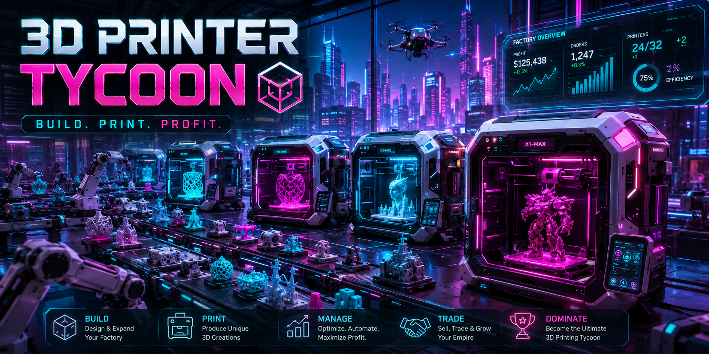
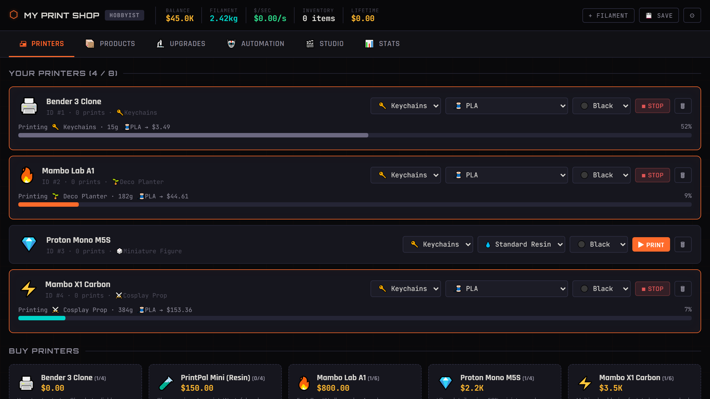
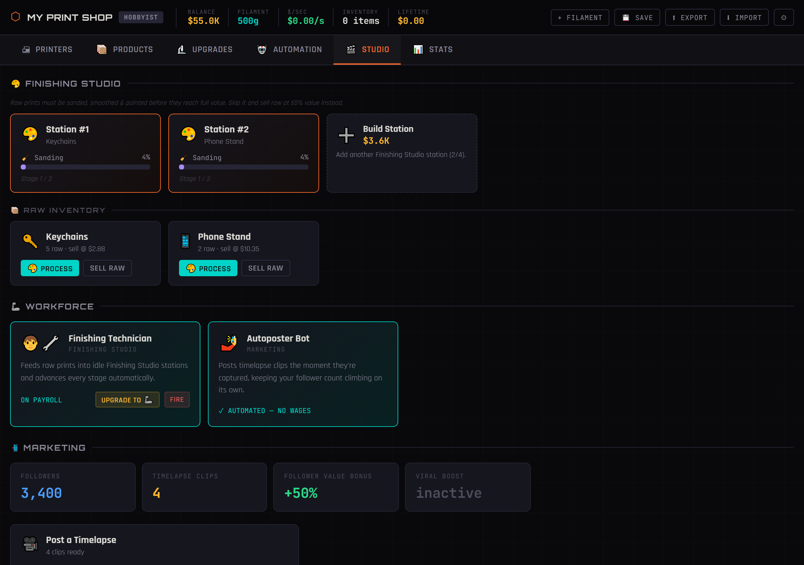

<div align="center">

# 🖨️ 3DP Tycoon

**Build your 3D printing empire from a single bedroom printer.**



An idle incremental business simulator where you grow a home-based 3D printing operation into a full manufacturing empire.


</div>

---

## What it does

3DP Tycoon is a browser-based idle incremental game where you start with a single free printer in a cramped bedroom and scale up to a full manufacturing empire. You manage filament stock, research upgrades, automate printing and selling, hire staff, post marketing content, and eventually prestige for permanent multipliers. It's a single-file HTML/JS game served via a minimal Node.js static server — no build step, no database, just open and play.

## 🎮 How to Play

1. **Start printing** — Select a product and hit ▶ PRINT on your Bender 3
2. **Sell products** — Go to the Products tab to sell your inventory for cash
3. **Buy filament** — Stock up on different materials and colours, or automation will idle your printers
4. **Upgrade** — Research speed, efficiency, quality, and business upgrades
5. **Automate** — Unlock auto-print, auto-sell, and filament resupply
6. **Expand** — Buy printers with different speed/quality/cost tradeoffs and unlock premium products
7. **Make room** — You start with space for 1 printer; research cheap shelving upgrades to grow to 8, then rent office/industrial space beyond that
8. **Finish** — Research the Post-Processing Kit to sand, smooth & paint prints for full value in the Studio tab
9. **Market** — Post timelapse clips or attend exhibitions for followers, value boosts, and a shot at going viral
10. **Staff up** — Hire workers (wages) or buy robot arms (one-time cost) to automate finishing and marketing
11. **Scale Up** — Prestige for a permanent earnings multiplier

## Features

- **10 distinct printers** spanning free starter clones to $120k metal SLS machines, each with unique speed, quality, cost, and fail-rate tradeoffs
- **20 product tiers** from cheap novelties to aerospace components, with premium products locked behind progression
- **8 filament/resin materials and 9 colours** — each printer is loaded independently, with real cost/quality/reliability tradeoffs and a cosmetic colour bonus
- **Workshop space system** — start with 1 printer slot, expand via shelving upgrades then rent offices, warehouses, and mega factories with ongoing rent costs
- **Finishing Studio** — post-processing (sanding, smoothing, painting) unlocked by research for full product value
- **Marketing system** — post timelapse clips or attend randomly triggered exhibitions (Maker Faire → International Expo) to gain followers, value boosts, and viral chances
- **Workforce** — hire human workers (wages) or buy robot arms (one-time cost) to automate finishing and marketing
- **Full automation** — unlock auto-print, auto-sell, and filament resupply so the operation runs hands-off
- **Achievements** — unlock tracking across prints, earnings, followers, and more
- **Prestige** — reset for a permanent earnings multiplier and replay with a head start
- **Save export/import** — clipboard-based base64 save codes alongside `localStorage` auto-save

## 📸 Screenshots





---

## 🖨️ Printers

Every printer trades off **speed**, **quality** (product value multiplier) and **cost** differently — there's no single best machine. Quality is judged as your fleet average, so a mix of machines shapes your overall sale prices; each printer also has its own filament efficiency and fail-rate modifier.

| Printer | Cost | Speed | Quality | Notes |
|---|---|---|---|---|
| Bender 3 Clone | Free | 1× | Baseline | Reliable starter |
| PrintPal Mini (Resin) | $150 | 1.3× | Low | Cheap but wasteful & finicky |
| Mambo Lab A1 | $800 | 2.5× | Above baseline | Solid all-rounder |
| Proton Mono M5S (Resin) | $2,200 | 3.5× | High | +60% miniature value |
| Mambo X1 Carbon | $3,500 | 5× | High | Fast, reliable, industry standard |
| Boron 2.4 350 | $9,500 | 9× | Below baseline | Extreme speed, DIY reliability issues |
| Gantry X9 Farm Unit | $18,000 | 14× | Below baseline | Built for volume, not finish |
| Helix CNC Precision Mill | $30,000 | 2× | Very high | Slow subtractive precision |
| Industrial FDM | $55,000 | 18× | High | Commercial-grade bulk production |
| Titan SLS Metal Printer | $120,000 | 4× | Highest | Best-in-class, slow & pricey |

## 📦 Products

20 product tiers from cheap novelties to aerospace-grade components — keychains, bottle openers, phone stands, coasters, cable organizers, desk organizers, miniatures, phone cases, jewelry boxes, planters, lamp shades, cosplay props, drone frames, RC car parts, architectural models, industrial parts, tooling jigs, prosthetic parts, automotive parts, and aerospace components.

## 🧵 Materials & Colours

Each printer is loaded with its own **material** and **colour** — swap them any time from the printer card. Filament (FDM) printers and resin printers each pick from their own set of materials:

| Material | Class | Cost | Quality | Reliability |
|---|---|---|---|---|
| PLA | Filament | Baseline | Baseline | Baseline |
| PETG | Filament | +30% | +8% | Tougher, fewer fails |
| ABS | Filament | +15% | +3% | Warps more, fails more |
| TPU (Flexible) | Filament | +80% | +12% | Trickier to print |
| Nylon | Filament | +120% | +20% | Absorbs moisture, fails more |
| Carbon Fiber Composite | Filament | +200% | +35% | Slightly fussier |
| Standard Resin | Resin | +150% | +15% | Baseline |
| Tough Resin | Resin | +250% | +30% | More reliable |

Colour is purely cosmetic (Black, White, Brown, Red, Orange, Yellow, Green, Blue, Purple) but still nudges sale value a little — your whole printer fleet's average material quality and colour choice feed into every sale, alongside fleet printer quality.

---

## 🏠 Workshop Space

You start in a cramped bedroom with room for just **1 printer**. A cheap, early Workshop Space upgrade line (its own tree in Upgrades) grows that:

| Upgrade | Cost | Capacity after |
|---|---|---|
| *(starting room)* | — | 1 |
| Wall-Mounted Shelving | $250 | 3 |
| Overhead Rack System | $900 | 5 |
| Mezzanine Storage | $3,000 | 8 |

Once you've maxed out the room at 8, rent external space to keep growing:

| Space | Furnishing (one-time) | Rent | Capacity |
|---|---|---|---|
| Small Office Unit | $15,000 | $0.06/sec | +10 |
| Industrial Warehouse | $80,000 | $0.28/sec | +30 |
| Mega Factory Complex | $400,000 | $1.20/sec | +100 |

Rent is deducted automatically like staff wages — fall behind and the space's capacity bonus pauses (existing printers keep working) until you catch up.

## 🎪 Exhibitions

Once you've researched Social Media Presence, random exhibition invitations pop up — Local Maker Faire, Comic Con Artist Alley, Regional Trade Show, or International Expo. Pay the booth cost to gain followers and a temporary value boost, or skip it for free.

---

## 🎨 Finishing Studio (Post-Processing)

Unlocked by the **Post-Processing Kit** upgrade. Raw prints sit in a Raw Inventory until they're run through a station:

| Stage | Icon |
|---|---|
| Sanding | 🧹 |
| Smoothing | 🪄 |
| Painting | 🖌️ |

- Fully finished items sell for full value; skipping the studio and selling raw pays only 65%.
- Build up to 4 stations (cost scales per station).
- Automate the whole pipeline by hiring a **Finishing Technician** or buying a **Finishing Robot Arm**.

## 🦾 Workforce (Workers & Robot Arms)

Automate the Studio and Marketing tabs without touching upgrades:

| Role | Worker (wage/sec) | Robot Arm (one-time) |
|---|---|---|
| Finishing Technician / Finishing Robot Arm | $0.15/sec | $4,000 |
| Social Media Manager / Autoposter Bot | $0.12/sec | $3,000 |

Workers get paid automatically from your balance each tick — if you run out of cash they pause until you can afford it. Robot arms cost more upfront but never need paying.

## 📲 Marketing (Timelapses & Followers)

Completed prints have a chance to capture a timelapse clip. Post clips from the Studio tab to gain followers and a temporary sell-value boost — with a chance to go viral for a much bigger payout. Followers also grant a small permanent value bonus (capped at +50%).

---

## 🔑 Keyboard Shortcuts

| Key | Action |
|---|---|
| `` ` `` | Open debug console |
| `1–6` | Switch tabs (Printers, Products, Upgrades, Automation, Studio, Stats) |
| `Ctrl+S` | Save game |

## 🐛 Debug Codes

Open the debug console with `` ` `` and enter:

| Code | Effect |
|---|---|
| `HELP` | List all codes |
| `FILLAMENT` | +10kg of every material |
| `MONEYBAGS` | +$10,000 |
| `FATSTACK` | +$1,000,000 |
| `SPEEDRUN` | 5× speed for 60s |
| `UNLOCKALL` | Unlock all products |
| `RESEARCHALL` | Apply all upgrades |
| `AUTOALL` | Install all automation |
| `GODMODE` | Everything |
| `PRINTFARM` | Spawn printer farm |
| `PHASE5` | Jump to Empire phase |
| `PRESTIGE1` | Apply first prestige |
| `GOVIRAL` | +5 timelapse clips, +500 followers |
| `EXPAND` | Unlock all workshop space & rentals |
| `EXPO` | Force an exhibition invitation |

---

## Tech Stack

| Layer | Choice |
|---|---|
| Frontend | Single-file HTML + JavaScript |
| Server | Node.js (static file server) |

## Quick Start

```bash
git clone https://github.com/TheBooleanJulian/3dp-tycoon
cd 3dp-tycoon
node server.js
```

Then open `http://localhost:3000` (or whichever port `server.js` binds) in your browser.

## Project Structure

```
3dp-tycoon/
|-- index.html       # Entire game — UI, logic, state
|-- server.js        # Static file server (also serves assets/*)
|-- assets/
|   |-- hero.png     # Key art — README cover image & boot loading-screen backdrop
|   |-- hero2.png    # Screenshot — Printers tab
|   `-- hero3.png    # Screenshot — Studio tab
`-- package.json
```

## 🚀 Deployment

### GitHub Pages
Push to GitHub and enable Pages for the `main` branch.

### Zeabur
1. Push to GitHub
2. Connect repo to Zeabur
3. Select **Node.js** runtime — it auto-detects `server.js`
4. Deploy!

---

## 💾 Save System

- **Auto-saves** every 60 seconds
- **Auto-saves** on tab close / page hide
- Manual save with `Ctrl+S` or the 💾 button
- Save data stored in the browser's `localStorage` — **there is no server or cloud backend**, so saves never leave the browser they were created in
- ⚠️ **No cross-device/cross-browser sync.** A different browser, a different device, a private/incognito window, or clearing site data will not see an existing save. Deploying new versions of the game is safe (it doesn't touch anyone's `localStorage`), but switching domains/ports, or the player clearing their browser data, will orphan it.
- Use the **⬆ EXPORT** button (or `EXPORT` debug code) to copy a portable base64 save code to your clipboard, and **⬇ IMPORT** (HUD button, splash-screen button, or `IMPORT` debug code) to restore it — this is the only way to back up a save or move it to another browser/device

---

## 📋 Changelog

Versioning follows `MAJOR.MINOR.PATCH`: **major** bumps for breaking/structural changes (save format, core loop rework), **minor** bumps for new features (printers, products, systems), **patch** bumps for balance tweaks and bug fixes.

### v1.4.1
- Export/Import save codes are now actually reachable in the UI (⬆ EXPORT / ⬇ IMPORT buttons in the HUD, plus an Import option on the splash screen) — previously the functions existed but weren't wired to anything
- Made the local-only, no-cloud-sync nature of saves explicit to players: a splash-screen notice, a tooltip on the SAVE button, and this README's Save System section all now call it out directly

### v1.4.0
- Filament materials: 6 FDM materials + 2 resins, each with its own cost/quality/reliability tradeoffs, loaded independently per printer
- Colours: 9 cosmetic colour options per printer, each with a small fleet-averaged value bonus
- Filament shop reworked into a per-material grid (stock, price, and quick-buy per material); auto-resupply now tops up whichever materials your printers actually use
- Boot loading screen: a hero screenshot backdrop with an animated (cosmetic) loading bar before revealing the start form
- `server.js` now serves real static files (previously it always returned `index.html`, which silently broke any image/asset the game references)
- Fixed a rendering bug where the entire active tab was rebuilt on every animation frame (60/sec), which could occasionally swallow a real mouse click — most noticeably on a new player's very first ▶ PRINT click

### v1.3.0
- Expanded to 20 products (from 7) spanning novelties to aerospace components
- 4 new printers with real speed/quality/cost tradeoffs (PrintPal Mini, Gantry X9 Farm Unit, Helix CNC Precision Mill, Titan SLS Metal Printer); printer buy cards show star ratings, fail risk & filament efficiency
- Fleet quality system: your printer roster's average quality now affects sale prices
- Workshop Space: start with a 1-printer room, grow it to 8 via 3 cheap shelving upgrades, then rent 3 tiers of office/industrial space with one-time furnishing + ongoing rent for further capacity
- Exhibition random events: attend a booth (Maker Faire → International Expo) for followers + a temporary value boost, or skip for free
- 3 new achievements (Machine Shop, Trade Show Regular, Factory Floor) and `EXPAND`/`EXPO` debug codes

### v1.2.0
- Finishing Studio: post-print sanding/smoothing/painting pipeline with sellable raw-vs-processed pricing
- Workforce system: hire wage-earning workers or buy one-time robot arms to automate finishing & marketing
- Marketing system: timelapse capture, follower count, viral posts, and temporary/permanent value bonuses
- 3 new achievements (Finishing Touches, Influencer, Went Viral) and `GOVIRAL` debug code

### v1.1.0
- Achievements system with unlock tracking
- Save export/import via clipboard (base64)

### v1.0.0 — Initial Release
- Core idle loop: print, sell, buy filament, research, automate, expand, prestige
- 6 printers (Bender 3 Clone → Industrial FDM), 7 product tiers
- Debug console with cheat codes
- Auto-save (interval + on tab close) and manual save

---

## 🗺️ Future Roadmap

- **Sound & music** — printer hum, sale chimes, ambient workshop track with a mute toggle
- **Mobile-friendly layout** — touch-sized controls and a responsive layout for phones/tablets
- **Cloud save sync** — optional account-based save backup so progress isn't tied to one browser
- **Leaderboards** — compare prestige count / net worth with other players (needs a backend)
- **More prestige layers** — a second "meta" prestige beyond `PRESTIGE1` for long-term progression
- **More random events** — printer jams, filament price swings, and other variance beyond bulk orders & exhibitions
- **Statistics dashboard** — lifetime totals, per-product profit graphs, printtime breakdown
- **Themes/skins** — alternate UI palettes or a light mode
- **Mod/community recipes** — JSON-defined custom products or printers for self-hosters
- **Test coverage** — no automated tests currently exist for the game logic
- **`.env` configuration** — no runtime settings are configurable yet (e.g. server port is hardcoded with an env override)

---

## License

This project is dual licensed.

- **Community Edition** — [GNU Affero General Public License v3 (AGPLv3)](https://github.com/TheBooleanJulian/thebooleanjulian.github.io/blob/main/LICENSE). Free to use, modify, and self-host. If you distribute a modified version or run it as a network service, you must make the corresponding source available.
- **Commercial License** — for organisations that want to embed, modify, or distribute this software without AGPLv3's obligations. See [COMMERCIAL-LICENSE.md](https://github.com/TheBooleanJulian/thebooleanjulian.github.io/blob/main/COMMERCIAL-LICENSE.md).

---

<div align="center">
<sub>Built by <a href="https://github.com/TheBooleanJulian">@TheBooleanJulian</a> · Made with ❤️ and molten filament.</sub>
</div>
